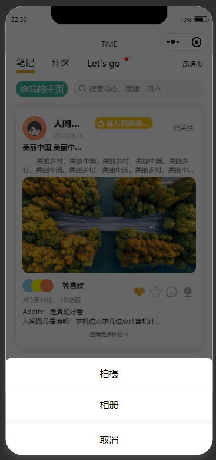
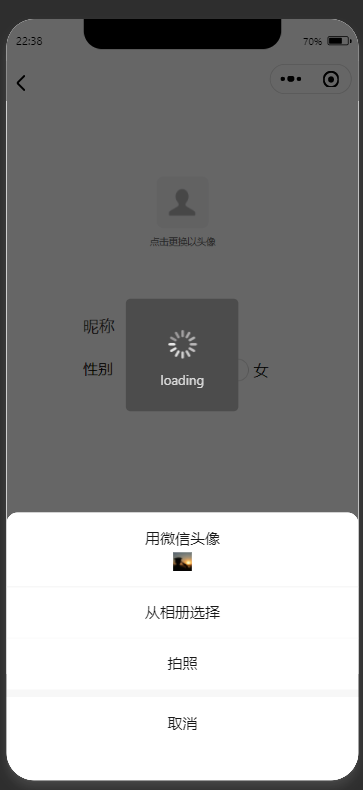

# TalkToTime
The community of life traveling，增加生活乐趣

原使用微信小程序开发，为了统一web与小程序，结合参考uniapp、 taro，选择这种框架就表示越简单越好，最终选择uniapp，小程序的api，vue的开发模式。

|                                                              |                                                              |
| ------------------------------------------------------------ | ------------------------------------------------------------ |
|  |  |
|  |  |
|                                                              |                                                              |